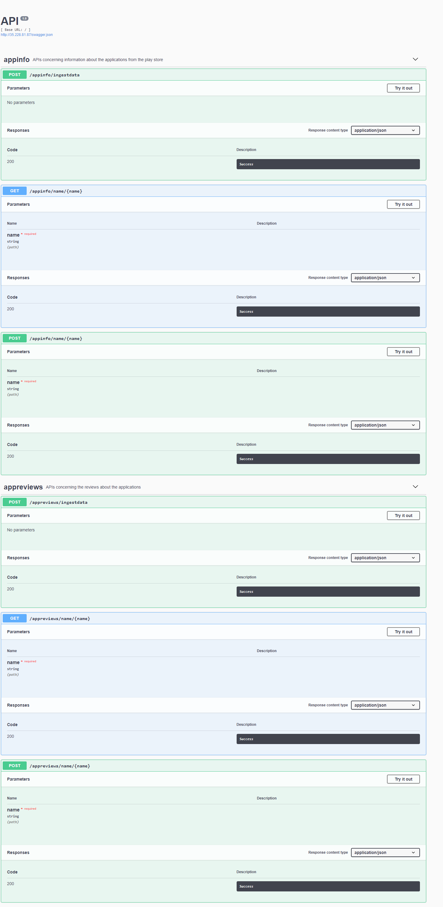
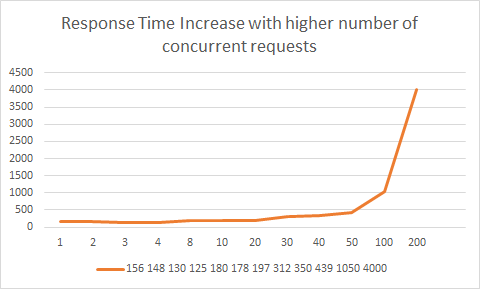

# Report

### Part 1 - Design (weighted factor for grades = 2)

##### 1. Design and explain interactions between main components in your architecture of mysimbdp (1 point)

The main components in the big data platform are the REST APIs built using Python, Flask and the database system MongoDB. Interaction between the REST API and the database also is in Python using Pymongo package.
The clients are enabled to make requests to the REST API and can send their data. The REST API handles these requests and validates the data. Next it is pushed to the Database. If its a read request, then data is returned via the API.

##### 2. Explain how many nodes are needed in the deployment of mysimbdp-coredms so that this component can work property (theoretically based on the selected technology ) (1 point)

There are three main nodes in my design of the system.
* The REST APIs
* pymongo layer which is the connector to the database and
* the database itself.

##### 3. Will you use VMs or containers for mysimbdp and explain the reasons for each component (1 point)

I have chosen to use virtual machine for my deployment, as my system is based on Windows and all the tools and softwares are easier to be deployed on linux. I chose a Linux Debian VM for the system.

##### 4. Explain how would you scale mysimbdp to allow a lot of users using mysimbdp-dataingest to push data into mysimbdp (1 point)

The system I have built is already scaled for many users to push data. Authentication can be added to the APIs and this can support multiple users with ease and the users will not have access to the database directly.

##### 5. Explain your choice of industrial cloud infrastructure and/or mysimbdp-coredms provider, when you do not have enough infrastructural resources for provisioning mysimbdp (1 point)

I would ideally choose GCP's Datastore services. Cloud Datastore is a highly-scalable NoSQL database for all applications. We can also use GCP CLoud Functions to have a scalable serverless deployment of the system.

### Part 2 - Development and deployment (weighted factor for grades = 2)

##### 1. Design and explain the data schema/structure for mysimbdp-coredms (1 point)

The above two are the JSON schemas for the two different types of data. the first dataset is app information and has 14 columns, and the other dataset consists of reviews which has 6 columns.
##### 2. Explain how would you partition the data in mysimbdp-coredms into different shards/partitions (1 point)
Sharding is a method of splitting and storing a single logical dataset in multiple databases. By distributing the data among multiple machines, a cluster of database systems can store larger dataset and handle additional requests. Sharding is necessary if a dataset is too large to be stored in a single database. Sharding allows a database cluster to scale along with its data and traffic growth. The sharding to be used for this application is horizontal sharding. We can use category and apply a simple filter but combine half the categories to one shard and the other half to another shard.

For example,
###### Shard 1 : 5686 Entries
* FAMILY
* MEDICAL
* SOCIAL
* SHOPPING
* SPORTS
* PHOTOGRAPHY
* TRAVEL_AND_LOCAL
* PERSONALIZATION
* TOOLS
* PRODUCTIVITY
* PARENTING

###### Shard 2: 5154 Entries
* ART_AND_DESIGN
* AUTO_AND_VEHICLES
* BEAUTY
* BOOKS_AND_REFERENCE
* BUSINESS
* COMICS
* COMMUNICATION
* DATING
* EDUCATION
* ENTERTAINMENT
* EVENTS
* FOOD_AND_DRINK
* FINANCE
* HEALTH_AND_FITNESS
* HOUSE_AND_HOME
* LIBRARIES_AND_DEMO
* LIFESTYLE
* GAME
* WEATHER
* VIDEO_PLAYERS
* NEWS_AND_MAGAZINES
* MAPS_AND_NAVIGATION

As the pie chart illustrates, the shards are almost equally split. And the bucketing of the categories can be handled in mysimbdpdaas system.

##### 3. Write a mysimbdp-dataingest that takes data from your selected sources and stores the data into mysimbdp-coredms (1 point)

File under `code/mysimbdp-dataingest.py`

##### 4. Given your deployment environment, show the uploading performance (response time and failure) of the tests for 1,5, 10, .., n of concurrent mysimbdp-dataingest pushing data into mysimbdp-coredms (1 point)

Tests upto 200 concurrent requests is conducted using threading in Python. There we no reported failures. However the response time increased exponentially when the number of concurrent requests increased. Below is the graph showing the response times for various number of concurrent requests. This means that when the DB is busy, the subsequent requests are queued up which explains the increase in response time.

##### 5. Observing the performance and failure problems when you push a lot of data into mysimbdp-coredms (you do not need to worry about duplicated data in mysimbdp), propose the change of your deployment to avoid such problems (or explain why you do not have any problem with your deployment) (1 point)

Since the database is getting overloaded, the correct method to handle multiple requests is to add a layer before the data ingest layer. For this a system like Apache Kafka can be used which is used for building real-time data pipelines and streaming apps. It is horizontally scalable, fault-tolerant, wicked fast, and runs in production in thousands of companies. A streaming platform has three key capabilities:

* Publish and subscribe to streams of records, similar to a message queue or enterprise messaging system.
* Store streams of records in a fault-tolerant durable way.
* Process streams of records as they occur.

[Ref](https://kafka.apache.org/intro.html)

### Part 3 Extension with discovery and (weighted factor for grades = 1)

##### 1. Assume that each of your tenants/users will need a dedicated mysimbdp-coredms. Design the data schema of service information for mysimbdp-coredms that can be published into an existing registry (like ZooKeeper, consul or etcd) so that you can find information about which mysimbdp-coredms for which tenants/users. (1 point)

Since we have multiple coredms, one for each user, we store the User id and the corresponding mongo db sevice information in a registry system like Zookeper. ZooKeeper is a centralized service for maintaining configuration information, naming, providing distributed synchronization, and providing group services. ZooKeeper aims at distilling the essence of these different services into a very simple interface to a centralized coordination service. The service itself is distributed and highly reliable. Then the user is matched with the right database and can connect with the corresponding db.

##### 2. Assume that the service information about mysimbdp-coredms for a tenant/users is in a file, write a program that can be used to publish the service information of mysimbdpcoredms into either etcd, consul or Zookeeper (1 point)

##### 3. Explain how you would change the implementation of mysimbdp-dataingest (in Part 2) to integrate a service discovery feature (no implementation is required) (1 point)

The implementation of dataingest currently takes data from the csv file and pushes it to the DB, but after adding the service discovery feature the data ingest code first connects to Zookeper and gets the information about the service information of mysimbdpcoredms and then actually connects to the db.

##### 4. Explain APIs you would design for mysimbdp-daas so that any other developer who wants to implement mysimbdp-dataingest can write his/her own ingestion program to write the data into mysimbdp-coredms by calling mysimbdp-daas (1 point)

The APIs that I have implemented support this. The APIs are REST endpoints, so the data can be pushed from any program. It can be done even using a web browser or other tools like Postman. Here are the different API options :

##### 5. Assume that now only mysimbdp-daas can read and write data into mysimbdp-coredms, how would you change your mysimbdp-dataingest (in Part 2) to work with mysimbdpdaas (1 point)

mysimbdp-dataingest now can send data to the same REST APIs that I have from question 4. S, data ingest. The code for this is in directory `code/client.py` This can be written in other programming languages also, or a request can be made through other tools like Postman.

### Describe how to run/deploy your code

[It is described in another Markdown file in the same reports directory, setup_README.md](setup_README.md)

### Bonus points
In this assignment, you do not have to develop mysimbdp-daas but if you do the implementation
and test the performance of ingesting data into mybdp-coredms through mysimbdp-daas, you
get 5 bonus points.

Please find the implementation of mysimbdp-daas under `code/mysimbdp-daas.py`

Tests upto 200 concurrent requests is conducted using threading in Python. There we no reported failures. However the response time increased exponentially when the number of concurrent requests increased. Below is the graph showing the response times for various number of concurrent requests. This means that the Server of the REST API is queueing up operations which means the database is not under as much stress as before.

We can compare this performance with the performance with the performance from the previous Part 2 graph. Below is the graph for comparison. As we can clearly see, the performance is slightly better, but it is still not optimal for high amount of concurrent requests. For this, a streaming platform can be used to improve the performance further.

